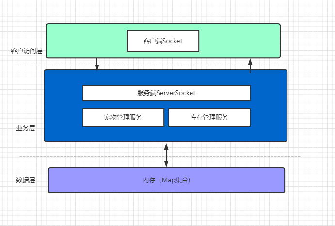
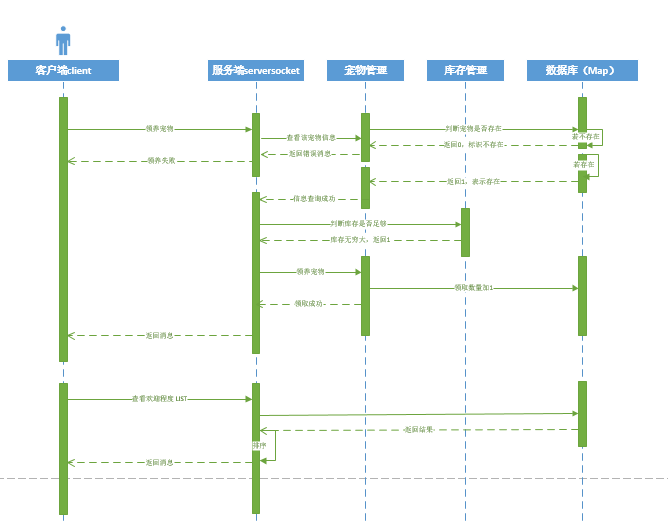

### 题目
```
需求
1. 本题⽬的⽬的是测试编程基本功、⽹上知识搜索、⾃学能⼒，但应独⽴完成代码编写级测试。
2. 部分条款会要求不使⽤标准库函数和第三⽅开源软件等，要求⾃⾏实现，请仔细阅读题⽬要求。
3. 模拟⼀个宠物领送系统。服务端在内存保存数据即可，不涉及数据库存储等⽅⾯。
4. 使⽤ java.net.ServerSocket 实现⼀个服务端监听程序，使⽤java.net.Socket实现⼀个客户端发送请求。
   要求：不要使⽤开源软件的服务框架。请⾃⾏实现TCP连接建⽴、请求处理。
5. 有如下请求和响应
   5.1 领养宠物请求, 可供收养的的动物有狗、猫、鹦鹉、⼩鸡等。⽐如领养⼀只⼩狗，客户端可以发送：
   GET: dog
   5.2 如果操作成功，服务端返回：OK
   如果操作失败，返回
   ERR
   5.3 宠物的种类不受限制，客户端领养任何宠物，服务端都假设⾜够数量的该宠物，因此客户端总可以领养成功。
   5.4 如果领养成功，服务端将对应的宠物计数加1。
   5.5 客户端可以查询各宠物受欢迎的程度，服务端会按领养计数，从⼤到⼩排序，输出⼀个列表。
   要求： 不要使⽤标准库的排序函数。请⾃⾏实现⼀个排序算法。
   客户端请求：
   LIST
   服务端返回（如下数字仅是示例，应根据实际的客户端请求统计输出）:
   dog: 1387
   cat: 1011
   chicken: 120
   parrot: 1
   OK
   5.6 多个客户端同时发送请求，每个客户端每秒钟可以发送数百个模拟领养请求，要求服务端能够并发的处理请求，计数正确。
   5.7 要求代码有合理的逻辑分导和模快化，规范的类、函数、变量命名，以及JUnit单元测试。
   5.8 将项⽬源码上传到 https://github.com/ ，提供github代码仓库的链接。
```

### 架构图




```
说明：因为项目比较小，所以结构图中忽略了一些展示，只用了dos窗口，用Map集合作为项目的数据库
1. 客户输入宠物名称（比如：dog),客户端通过socket将信息传送到服务端，服务端将接收的信息在宠物管理进行匹配，如果没有，返回ERR，反之，调用库存，，因为库存无穷大，索引返回1
2. 此时服务端继续向宠物管理服务调取领养宠物接口，并返回领养成功
3. 回显客户端消息
```

### 时序图




参考地址：https://blog.51cto.com/14815984/2505409
